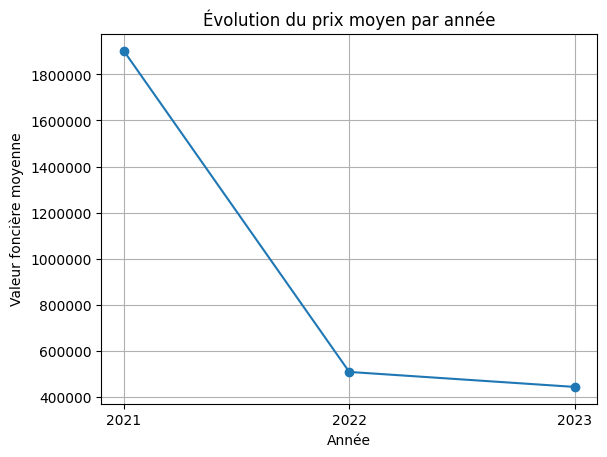
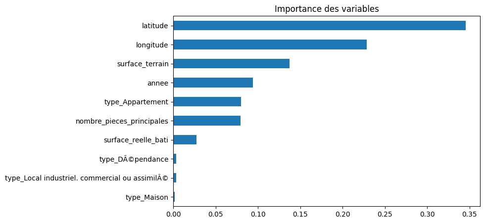

# Projet Data Science de prédiction des prix immobiliers en France (2021–2023) utilisant Python, l'analyse exploratoire des données et le Machine Learning.

## Présentation du projet

Ce projet a pour objectif d'analyser les transactions immobilières réalisées en France entre 2021 et 2023 et de développer un modèle de Machine Learning capable de prédire la valeur foncière des biens immobiliers.

L'étude couvre l'ensemble du processus de Data Science, depuis la préparation des données jusqu'à la modélisation prédictive et l'interprétation des résultats.

---

## Objectifs

- Analyser l'évolution des prix immobiliers au fil des années.
- Identifier les facteurs influençant la valeur des biens.
- Réaliser des visualisations afin de mieux comprendre les données.
- Construire un modèle prédictif de prix immobiliers.
- Évaluer les performances du modèle à l'aide de métriques adaptées.

---

## Jeu de données

Le projet utilise les données des transactions immobilières françaises des années :

- 2021
- 2022
- 2023

Variables principales étudiées :

- Valeur foncière
- Surface réelle bâtie
- Surface du terrain
- Nombre de pièces principales
- Type de bien
- Latitude et longitude
- Année de transaction

---

## Technologies utilisées

- Python
- Pandas
- NumPy
- Matplotlib
- Seaborn
- Scikit-Learn
- Google Colab

---

## Préparation des données

Les étapes suivantes ont été réalisées :

- Fusion des données 2021, 2022 et 2023
- Traitement des valeurs manquantes
- Suppression des doublons
- Conversion des types de données
- Détection des valeurs aberrantes (IQR)
- Création de nouvelles variables (prix au m²)
- Encodage des variables catégorielles
- Normalisation des variables numériques

---

## Analyse Exploratoire des Données (EDA)

Plusieurs analyses ont été réalisées :

### Statistiques descriptives

- Moyenne
- Médiane
- Variance
- Écart-type
- Asymétrie (Skewness)

### Visualisations

- Boxplots
- Scatterplots
- Matrice de corrélation
- Évolution du prix moyen par année
- Évolution du prix moyen selon le type de bien

### Principaux résultats

- Les prix immobiliers présentent une forte dispersion.
- La présence de nombreuses valeurs extrêmes a été observée.
- La localisation géographique influence fortement les prix.
- Les biens industriels et commerciaux présentent des valeurs plus élevées que les biens résidentiels.

---

## Modèle de Machine Learning

### Algorithme utilisé

Random Forest Regressor

### Variables explicatives

- Surface réelle bâtie
- Surface du terrain
- Nombre de pièces principales
- Latitude
- Longitude
- Année
- Type de bien

### Variable cible

- Valeur foncière

---

##  Résultats du modèle

| Indicateur | Valeur |
|------------|---------|
| R²         |  0.68   |
| MAE        |935 198  |
| RMSE       |7 376 696|

### Interprétation

Le modèle explique environ **68,7 % de la variation des prix immobiliers**, ce qui représente une performance satisfaisante compte tenu de la présence de nombreuses valeurs aberrantes dans le jeu de données.

---

##  Importance des variables

L'analyse de l'importance des variables montre que les facteurs les plus influents sont :

1. Latitude
2. Longitude
3. Surface du terrain
4. Année
5. Type de bien

Ces résultats confirment que **la localisation constitue le facteur principal dans la détermination du prix d'un bien immobilier**.

---

## Compétences mises en œuvre

- Nettoyage et préparation des données
- Analyse exploratoire des données (EDA)
- Visualisation des données
- Feature Engineering
- Machine Learning
- Évaluation de modèles prédictifs
- Programmation Python

---

## 📈 Évolution du prix moyen

## 📊 Matrice de corrélation

## 📉 Prix moyen par année

## 📈 Importance des variables

## Réalisé par

**Manel Garmachi**

 Junior Data Analyst 

